# Agent Harness — Overview

> **Type:** Context · **Audience:** All agents

---

This document is **orientation context**, not an executable skill. It gives you the full picture of the pipeline you are operating within. Your specific instructions for the current stage are in the corresponding skill file (`001_plan`, `002_build`, `003_1_review_pr`, `003_2_review_local`, `004_apply_fixes`, or `005_housekeeping`).

---

## Pipeline Summary

The harness moves a task from plan through to merged code via a sequence of agent-driven stages with human checkpoints. Each stage is defined by a skill that the agent adopts and executes. Most stages run locally; only review and housekeeping run in the cloud.

| Stage | Skill File | Actor | Environment |
|-------|------------|-------|-------------|
| Plan | `001_plan.md` | Planning Agent + Human (read-only exploration capability) | Local |
| Build | `002_build.md` | Coding Agent (edits + shell capability) | Local |
| Review (PR) | `003_1_review_pr.md` | Reviewer Agent (QA → Code Quality → Security → Architecture → Domain) | Cloud |
| Review (local) | `003_2_review_local.md` | Reviewer Agent (same five personas) | Local |
| Apply Fixes | `004_apply_fixes.md` | Fixer Agent (edits + shell capability) | Local |
| Housekeeping | `005_housekeeping.md` | Housekeeping Agent | Cloud |

## Flow Diagram

```mermaid
flowchart LR
    subgraph LOCAL
        H1([Human]) -->|triggers| P[001 Plan]
        P -->|"plan + conversation → draft PR"| H2([Human triggers build])
        H2 --> B[002 Build]
        B -->|"implement → verify functionality → verify conformance → fix loop"| PUSH[Push commits]
        PUSH --> H3([Human marks PR ready])
    end

    subgraph CLOUD
        H3 -->|PR ready for review| R[003 Review]
        R -->|"QA → Code Quality → Security → Architecture → Domain"| COMMENTS[PR comments P0–P3]
    end

    COMMENTS --> H4([Human triages])
    H4 -->|approves| MERGE[Merge PR]
    H4 -->|requests changes| F[004 Apply Fixes]

    subgraph LOCAL_FIX [LOCAL]
        F -->|"read PR comments → build fix list → fix → push"| PUSH_FIX[Push fixes]
    end

    PUSH_FIX -->|re-review| R

    MERGE -->|merge event| HK[005 Housekeeping]

    subgraph CLOUD_HK [CLOUD]
        HK -->|"audit deferred comments → housekeeping PR"| DONE([Done])
    end
```

## Key Concepts

- **Skills define behaviour.** Each agent adopts a skill that fully specifies what it should do, what context it needs, and what outputs it produces. You do not need additional configuration beyond the skill.
- **`AGENTS.md` is the internal context entry point.** All agents use `AGENTS.md` (loaded at session start) to navigate the codebase's documentation, architecture, standards, and domain knowledge.
- **Artifacts travel on the branch.** The coding plan, conversation summaries, and (post-merge) housekeeping audit all live under `harness/exec-plans/NNN-<jira-key>-short-desc/` and are committed to the branch so that downstream agents have full context. See `harness/exec-plans/README.md` for the full naming convention.
- **PR is the coordination surface.** All review comments, triage decisions, and fix requests happen on the PR. The Fixer Agent reads PR comment URLs directly to get full context with zero information loss.
- **Review covers five passes.** The Reviewer Agent performs QA, Code Quality, Security, Architecture Conformance, and Domain Conformance. If subagents are available they can run in parallel; otherwise they run sequentially in the listed order. On re-reviews, the agent also resolves comments that have been fixed.
- **Loops are bounded.** The build loop (implement → verify functionality → verify conformance → fix) runs until all checks pass. The fix loop (apply fixes → re-review) runs until the human approves.
- **Housekeeping outputs a PR, not Jira tickets.** Deferred or dismissed review findings are captured in a `housekeeping_audit.md` file and submitted as a separate PR to `main`.
