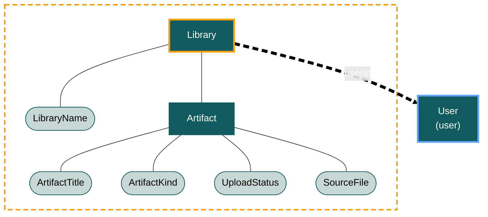

# Library — Domain Model

The `library` bounded context owns the user's **collection of source documents**: the named libraries a user organises their uploads into, and the individual artifacts (PDFs, articles, datasets, books) that live inside those libraries. Chats in the `chat` context are grounded in a library from this context.

This file is the canonical source for **aggregate boundaries, conceptual state, invariants, and lifecycle**. Field types, indexes, and storage shape live in [data-model.md](data-model.md). Term definitions and the values of every value object live in [language.md](language.md).

## Aggregate Roots

The context owns one aggregate root: `Library`. A user may have many libraries. `Library` carries `userId` directly (this context's tenancy anchor). The artifacts a library contains are modelled as an **internal entity** (`Artifact`) inside the `Library` aggregate, not as a separate aggregate root: artifacts are loaded, mutated, and queried through the library, and an artifact cannot be moved between libraries.

The diagram below shows every modelled element in this context: the aggregate is drawn as a dashed orange boundary containing its root, the internal entity it owns, and the value objects it composes. The cross-context reference to `User` (owned by the `user` context) is drawn as a dashed-id arrow leaving the context, and that external aggregate root uses the shared external-root styling from [../index.md#diagramming-conventions](../index.md#diagramming-conventions).

### `Library`

A named collection of source documents owned by exactly one `User`.

**State:**

- `id` — internal UUID. The value used as `libraryId` in cross-context references.
- `userId` — the owning user (tenant scope and cross-context parent reference; same field). The library context's tenancy anchor.
- `name` — `LibraryName` value object (the human-readable name shown in the sidebar / library overview).
- `description` — optional free-text description.
- `artifacts` — set of `Artifact` internal entities (zero or more). Loaded with the library; reached only through it.
- `isActive` — `true` for in-use libraries; `false` for deactivated. Soft-delete flag.
- `createdAt` — creation timestamp.
- `updatedAt` — last-modified timestamp.

**Invariants:**

- **Hard.** `id` is immutable.
- **Hard.** `userId` is immutable once set; libraries cannot be transferred between users (a library is owned by exactly one user for its entire lifetime).
- **Hard.** `name` is required and non-empty.
- **Hard.** `name` is unique within a user (no two libraries owned by the same user share a name). Comparison is case-insensitive, applied after trim.
- **Hard.** Every `Artifact.libraryId` inside the `artifacts` set equals this library's `id` — referential integrity is implicit because the artifact is internal to the library.
- **Hard.** A `Library` is never hard-deleted; deactivation flips `isActive` to `false`. Deactivated libraries continue to exist so historical chats in the `chat` context can resolve their `libraryId` references and so any in-flight citations still resolve.
- **Soft.** When a library is deactivated, its `Artifact`s remain readable (and citable from existing chats) but no new artifacts may be uploaded into it and no new chats may be created against it. This is enforced at the application layer; not by an index.

**Identity sourcing:** `Library.id` is platform-minted (UUID v4).

**Lifecycle:** Created by the user from the library overview UI (the "Library" sidebar item shown in the design). Mutated when the user renames it, edits its description, or uploads/removes artifacts. Deactivated (never deleted) when the user archives it. There is no transfer between users.

## Internal Entities

### `Artifact`

A single uploaded source document inside a `Library`. **Internal entity, not an aggregate root.** Loaded, mutated, and queried only through its parent library; never addressed directly from outside the `library` context. Cross-context references to a specific artifact (e.g. citations on a `ChatMessage`) carry the pair `(libraryId, artifactId)`.

**State:**

- `id` — internal UUID, unique within its parent library. The value used as `artifactId` in `(libraryId, artifactId)` cross-context references.
- `libraryId` — the parent library this artifact belongs to. Always equal to the parent `Library.id`; carried denormalised on the entity for clarity at the application layer. Tenancy is derived from the parent library (Artifact does not carry its own `userId`).
- `title` — `ArtifactTitle` value object (the human-readable title, defaulting to the source filename without extension).
- `kind` — `ArtifactKind` value object (closed enum: the category of the document, e.g. `pdf`, `article`, `dataset`, `book`).
- `uploadStatus` — `UploadStatus` value object (closed enum: where the artifact is in the upload/processing pipeline).
- `sourceFile` — `SourceFile` value object (storage location, byte size, mime type, content hash).
- `pageCount` — integer count of pages, set after processing completes. Required when `uploadStatus` is `ready`; absent otherwise.
- `uploadedAt` — timestamp of the original upload.
- `processedAt` — timestamp of the moment `uploadStatus` became `ready`. Absent until then.

**Invariants:**

- **Hard.** `id` is immutable and unique within its parent library.
- **Hard.** `libraryId` is immutable once set; artifacts cannot be moved between libraries (per the design decision: one artifact belongs to one library forever — re-upload to copy into another library).
- **Hard.** `title` is required and non-empty.
- **Hard.** `kind` is required (single closed-enum value).
- **Hard.** `uploadStatus` is required (single closed-enum value); transitions follow the lifecycle below — no skipping states.
- **Hard.** `sourceFile.sha256Hash` is unique within the parent library — the same exact file cannot be uploaded twice into the same library. Cross-library duplicates are allowed (a user may legitimately want the same paper in two thematic libraries).
- **Hard.** `sourceFile.byteSize` is a positive integer.
- **Hard.** `pageCount` is required and ≥ 1 when `uploadStatus` is `ready`; absent in every other state.
- **Hard.** `processedAt` is set if and only if `uploadStatus` is `ready`.
- **Hard.** An `Artifact` is never hard-deleted while its parent library is active; removal sets `uploadStatus` to `removed` (a terminal state). When the parent library is hard-deleted (which never happens in v1), artifacts go with it. Removed artifacts remain present so existing `Citation`s on `ChatMessage`s in the `chat` context still resolve to a recognisable record.

**Identity sourcing:** `Artifact.id` is platform-minted (UUID v4).

**Lifecycle:** Created when the user uploads a file (the "Drag & Drop PDF here" area or "Browse Files" in the library design). Transitions through the `UploadStatus` states: `uploading` → `processing` → `ready`, or `failed` from either of the first two. From `ready`, may transition to `removed` (terminal) when the user removes the artifact from the library. No transitions out of `failed` or `removed` — failed uploads must be retried as a fresh artifact.

## Value Objects

This section describes each value object's **cardinality and behavioural role**. Value enumerations and per-value meanings are owned by [language.md](language.md) and are not duplicated here.

### `LibraryName`

The human-readable name of a `Library`, composed on `Library` as `name`. **Single required value object, open form (validated string).** Trimmed on write; non-empty after trim. Unique within a user (see `Library` invariants).

### `ArtifactTitle`

The human-readable title of an `Artifact`, composed on `Artifact` as `title`. **Single required value object, open form (validated string).** Trimmed on write; non-empty after trim. Defaults at upload time to the source filename without extension; user-editable thereafter. No uniqueness constraint.

### `ArtifactKind`

The category of an `Artifact`. **Closed enum, exactly one value, required.** Composed on `Artifact` as `kind`. Drives the category chip shown on library cards (the small "RESEARCH" / "ARTICLE" / "DATASET" / "BOOK" pill in the library design). Values: see [language.md#artifactkind](language.md#artifactkind).

### `UploadStatus`

Where an `Artifact` is in its upload/processing pipeline. **Closed enum, exactly one value, required.** Composed on `Artifact` as `uploadStatus`. Lifecycle transitions are listed under `Artifact`'s lifecycle section above. Values: see [language.md#uploadstatus](language.md#uploadstatus).

### `SourceFile`

The stored binary backing an `Artifact`. **Single required value object, open form.** Composed on `Artifact` as `sourceFile`. Four fields:

- `storageUri` — opaque URI pointing to the stored binary in the platform's blob store. Treated as opaque in the domain.
- `byteSize` — integer size in bytes (positive).
- `mimeType` — IANA media type string (e.g. `application/pdf`). Validated as a syntactically well-formed media type; the active accepted set is gated at the application layer (v1: PDF only).
- `sha256Hash` — lower-cased hex SHA-256 of the file contents. Used to enforce within-library upload de-duplication (see `Artifact` invariants).

The four fields are set together at upload time and are immutable for the artifact's lifetime — re-uploading produces a new `Artifact`, never a mutated one.

## Boundaries with other contexts

- The `user` context is referenced only for tenancy. `Library.userId` is the sole link from the library context to the user context. No library element references `Email`, `Locale`, or any other user-level concept.
- The `chat` context references this context by `libraryId` (on `Chat`) and by the pair `(libraryId, artifactId)` (inside `Citation` value objects on `ChatMessage`s). Neither reference loads `Library` or `Artifact` directly — both go through this context's repository ports. Because `Artifact` is internal, the chat context cannot address it without also naming its parent library; the pair `(libraryId, artifactId)` is the only valid form of cross-context artifact reference.
- All cross-context references are by id only. The `Library` aggregate is never loaded directly from outside this context.
