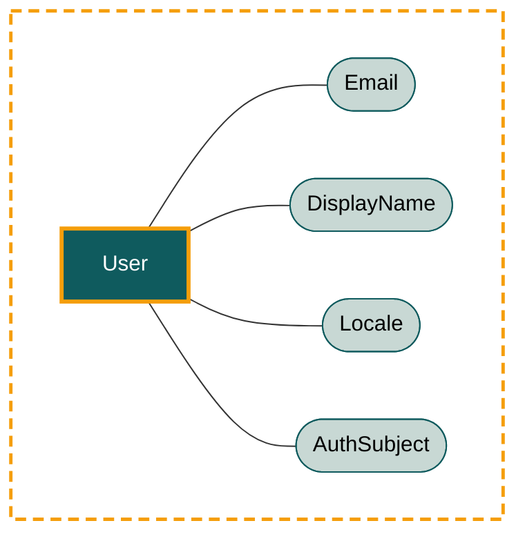

# User — Domain Model

The `user` bounded context owns the platform's **identity** model: who logs into Scholastic AI and the metadata that travels with them. It also absorbs the authentication concern (the platform delegates auth to a provider — see [language.md](language.md) — but this context owns the resulting domain identity).

This file is the canonical source for **aggregate boundaries, conceptual state, invariants, and behaviour**. Field types, indexes, and storage shape live in [data-model.md](data-model.md). Term definitions and the values of every value object live in [language.md](language.md).

## Aggregate Roots

The context owns one aggregate root: `User`. `User` is the platform's per-user scoping boundary — every aggregate root in every other context references it via `userId`. There is no organisation/team/customer concept above the user; one user is one tenant.

The diagram below shows every modelled element in this context: the aggregate is drawn as a dashed orange boundary containing its root and the value objects it composes. Visual encoding (node colours and shapes, line styles, reusable snippets) is defined once in [../index.md#diagramming-conventions](../index.md#diagramming-conventions).

### `User`

A human who logs into Scholastic AI. The unit of multi-tenancy.

**State:**

- `id` — internal UUID. The value used as `userId` everywhere.
- `email` — `Email` value object (validated, lower-cased login identifier).
- `displayName` — `DisplayName` value object (the name shown in the app shell, e.g. next to the avatar).
- `locale` — `Locale` value object (BCP 47 locale tag; drives UI language and date/number formatting).
- `authSubject` — `AuthSubject` value object (the auth provider's stable per-user identifier, plus the provider name).
- `isActive` — `true` for active users; `false` for deactivated. Soft-delete flag.
- `createdAt` — account-creation timestamp.
- `updatedAt` — last-modified timestamp.

**Invariants:**

- **Hard.** `id` is immutable.
- **Hard.** `email` is unique across the entire platform (it is also the bridge identifier the auth provider uses). Stored lower-cased; comparisons are case-insensitive.
- **Hard.** `email` is required and well-formed.
- **Hard.** `displayName` is required and non-empty.
- **Hard.** `locale` is required (single closed-enum value).
- **Hard.** `authSubject.subjectId` is unique across the entire platform within its `provider` (the same `(provider, subjectId)` pair never maps to two different users).
- **Hard.** A `User` is never hard-deleted; deactivation flips `isActive` to `false`. A deactivated user cannot log in but their identity persists so the `library` and `chat` contexts can resolve historical `userId` references.

**Identity sourcing:** `User.id` is platform-minted (UUID v4). The auth provider is the upstream authentication source; `email` is the human-facing shared identifier across the boundary, and `authSubject.subjectId` is the machine-facing stable identifier the provider mints for this person. Inside this context the `User` aggregate is the source of truth for who exists.

**Lifecycle:** Created on first successful authentication (the platform looks the user up by `email` after the auth provider authenticates them; if no `User` exists yet, one is provisioned). Deactivated (never deleted) when access is revoked. There is no transfer of identity between provider records — a different `(provider, subjectId)` is a different user.

## Value Objects

This section describes each value object's **cardinality and behavioural role**. Value enumerations and per-value meanings are owned by [language.md](language.md) and are not duplicated here.

### `Email`

The user's login identifier. **Single required value object, open form (validated string).** Composed on `User` as `email`. Stored lower-cased on write; comparisons are case-insensitive. Unique across all users (see `User` invariants).

### `DisplayName`

The human-facing name shown in the app shell next to the user's avatar. **Single required value object, open form (validated string).** Composed on `User` as `displayName`. Trimmed on write; non-empty after trim.

### `Locale`

The user's preferred BCP 47 locale tag. **Closed enum, exactly one value, required.** Composed on `User` as `locale`. Drives UI language and date/number formatting. Values: see [language.md#locale](language.md#locale).

### `AuthSubject`

The auth provider's stable per-user identifier. **Single required value object, open form.** Composed on `User` as `authSubject`. Two fields:

- `provider` — `AuthProvider` closed enum (the provider that minted this subject id). Values: see [language.md#authprovider](language.md#authprovider).
- `subjectId` — opaque string supplied by the provider; treated as opaque inside the platform. Unique within `provider`.

The pair `(provider, subjectId)` is the machine-facing identity bridge; `email` is the human-facing one. Both are kept on the user — `email` may change (preference, marriage, employer change) but `(provider, subjectId)` does not.

## Boundaries with other contexts

- The `library` context references this context only by `userId` (tenancy on `Library`). Library aggregates do not load `Email`, `DisplayName`, `Locale`, or any other user-level concept directly; if they need any, they go through this context's repository.
- The `chat` context references this context only by `userId` (tenancy on `Chat`). Same rule.
- All cross-context references are by id only. The `User` aggregate is never loaded directly from outside this context — other contexts must call into this context's repository ports.
