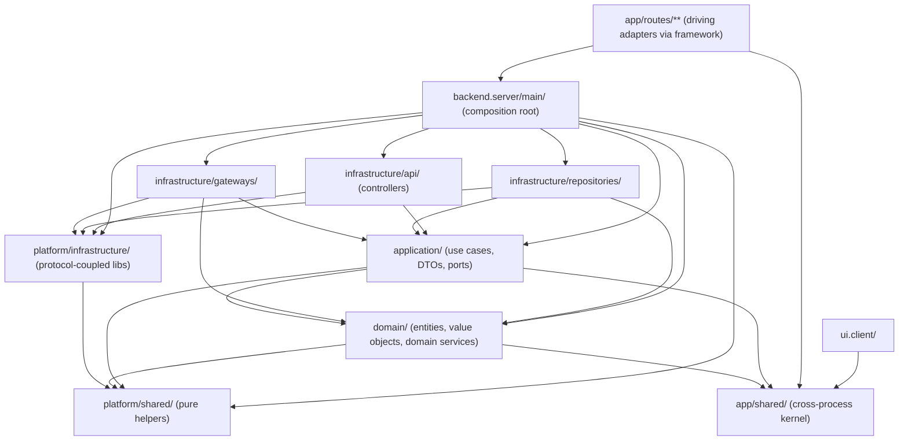

# Architecture Overview

This document is the entry point for understanding the Scholastic AI system — its structure, layers, dependency direction, and design philosophy. Every file in the repository must conform to the rules described here and in the linked documents.

The canonical statement of *why* the backend is structured the way it is lives in [backend/architecture-manifesto.md](./backend/architecture-manifesto.md). This document and its siblings state the *what* and the *how*.

## What the System Does

Scholastic AI is a personal digital library for studying. A single user signs in and uses it to:

1. **Upload PDFs** — drag-and-drop source documents (papers, articles, books) into libraries.
2. **Organise libraries** — group related artifacts (PDFs) into named libraries.
3. **Chat with a library** — ask questions grounded in the artifacts of one library; the assistant cites the source artifact and page.
4. **Revisit chats** — browse and resume past conversations per library.

The system serves a single persona: the **User** (the individual learner who owns the libraries and the chats).

For the high-level domain model, see the [Context Map](../domain/context-map.md). The detailed model and ubiquitous language for each bounded context live in the per-context folders under [`harness/knowledge/domain/`](../domain/index.md).

## Design Philosophy

The application is a **modular monolith**. The backend is structured as **onion architecture with ports and adapters**: concentric rings (`domain`, `application`, `infrastructure`) with dependencies pointing inward, and explicit ports between rings consumed via adapters in the outer ring.

Onion gives us the layering vocabulary. Hexagonal (ports/adapters) gives us the collaborator vocabulary (driving vs driven). We use both, deliberately. See [backend/architecture-manifesto.md](./backend/architecture-manifesto.md) for the full stance.

Core principles:

- **Single deployment unit** — frontend and backend deploy together, simplifying operations.
- **Strict frontend/backend isolation** — backend code (`.server`) never leaks into the client bundle; frontend code never runs on the server.
- **Onion + ports/adapters on the backend** — domain at the centre, application services as the use-case seam, infrastructure on the outside. Driving adapters (HTTP controllers, workers, CLIs) push inward; driven adapters (repositories, gateways) are pushed outward by application services through ports.
- **Application services are the public API of the backend** — every controller calls an application service. Direct repo or domain-service calls from controllers are architectural bugs, not shortcuts.
- **DTOs at every application-service boundary** — domain entities never cross the API boundary; controllers translate transport-shaped types to/from application DTOs.
- **Composition at one root** — concrete classes are instantiated only in `backend.server/main/`; no other ring calls `new` on an infrastructure class.
- **Shared kernel, minimal** — types and pure helpers shared between FE and BE live in `app/shared/`; the leaf of the dependency tree.
- **Breakout-ready** — the backend can be extracted into a standalone service because the controller layer (driving adapters) is the single public surface.

References:
- Simon Brown — [Modular Monoliths](https://www.youtube.com/watch?v=5OjqD-ow8GE)
- Martin Fowler — [Modular Monoliths](https://martinfowler.com/articles/modular-monoliths.html)

## Repository Structure

```
app/
├── backend.server/          # All server-side code (onion + ports/adapters)
│   ├── domain/              # Innermost ring — entities, value objects, domain services, domain events
│   ├── application/         # Use-case ring — application services, DTOs, mappers, application-owned ports
│   ├── infrastructure/      # Adapter ring
│   │   ├── api/             # Driving adapters: HTTP controllers, middleware, request/response schemas
│   │   ├── repositories/    # Driven adapters: persistence implementations
│   │   └── gateways/        # Driven adapters: external service adapters (auth, agents, third-party APIs)
│   ├── platform/            # Reusable backend-generic code, extraction-ready
│   │   ├── shared/          # Pure in-process utilities, importable by any ring
│   │   └── infrastructure/  # Protocol-coupled library code (DB clients, framework middleware, SDK wrappers)
│   └── main/                # Composition root — wires everything; only place process.env is read
│
├── ui.client/               # All client-side code
│   ├── components/          # React components (common/, domain/, layout/) with co-located hooks
│   ├── design-system/       # Tokens, styles, visual foundation
│   └── lib/                 # (planned) Client-only utilities (API client, cross-cutting `lib/hooks/`)
│
├── routes/                  # React Router file-based routes — the integration layer
│   ├── pages/               # Page routes (SSR, loaders, actions, rendering)
│   └── api/                 # API routes + SDK files for type-safe client calls
│
├── shared/                  # (planned) Shared kernel — the dependency-tree leaf
│   ├── domain/              # Shared domain types, enums, validation schemas
│   ├── api/                 # API contract types (request/response schemas)
│   ├── platform/            # Pure helpers consumed by both backend and frontend
│   └── lib/                 # Shared technical building blocks (transport, validation)
│
├── root.tsx                 # React Router root layout
├── entry.client.tsx         # Client entry point
└── entry.server.tsx         # Server entry point
```

> **Status:** `app/shared/`, `app/ui.client/lib/`, and the `tests/` tree do not yet exist in the codebase. They are part of the target architecture and will be created on first use. The harness still describes them so new code lands in the right place from day one.

Supporting directories outside `app/`:

```
tests/                       # (planned) Test suite mirroring source structure
harness/                     # Coding agent harness (you are here)
```

## Dependency Direction

All dependencies flow **inward** toward `domain/` and `shared/`. `platform/shared/` is universally importable; `platform/infrastructure/` is reachable only from `infrastructure/` and `main/`. `main/` is the only place that names concrete types from multiple rings.



`routes/` sits above this diagram: page and API routes import from `backend.server/main/controller.instances.ts` and from `ui.client/`. SDK files in `routes/api/` are imported by `ui.client/`.

The complete set of import rules — including the 6×6 ring matrix — is defined in [dependency-rules.md](./dependency-rules.md).

## Path Aliases

The architecture uses one alias per ring. The are the canonical naming used across all knowledge docs and code examples; the alias are all defined in `tsconfig.json` / `jest.config.js`.


## Technology Stack

Currently adopted (in `package.json`):

| Layer | Technology |
|-------|-----------|
| Framework | React Router v7 (React, SSR) |
| Language | TypeScript (strict mode) |
| Database | MongoDB via Mongoose + Typegoose |
| Validation | Zod schemas |
| Styling | Tailwind CSS |

Not yet chosen — will be added when needed:

- **Authentication** (TBD)
- **AI / LLM provider, embeddings, vector store** (TBD — chat is grounded in PDF artifacts)
- **PDF parsing / OCR** (TBD)
- **Object storage for uploaded PDFs** (TBD)
- **Test runner(s)** for unit, integration, and end-to-end tests (TBD)
- **Linting beyond `tsc --noEmit`** (TBD)
- **Observability** (TBD)
